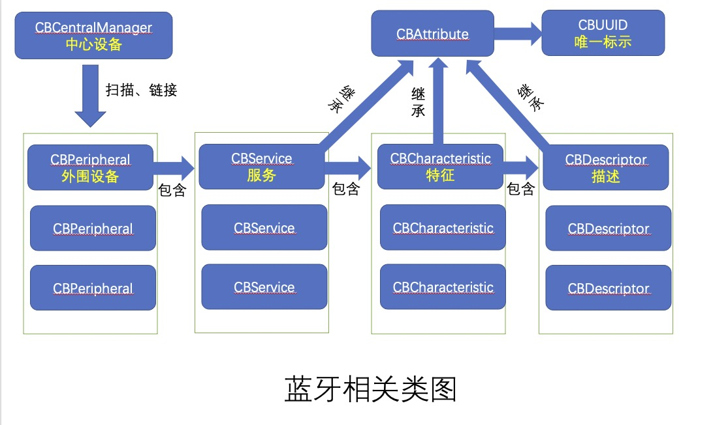

### 一、 基本概念

1. 中心设备（CBCentral）：是发起连接的主设备，如：App。
2. 中心设备管理（ CBCentralManager ）：主要管理中心设备，以及处理跟外设（外围设备）相关操作，主要是扫描、链接、断开外设。
3. 外围设备（CBPeripheral）：被连接的设备称为外部设备，如：体脂称，健康手环等；外设类，包含设备的基础属性，名字，uuid等信息。向外设写入数据。当中心设备连接到外设后，需要通过外设对象的代理方法进行数据交互。
4. 外围设备管理 （CBPeripheralManager）：设备的控制，主要可以为设备设置Service以及Characteristic，可以手动配置特定的服务和特征值，也可看作可以自定义蓝牙协议，例如将手机作为外设时可以为自己的手机蓝牙设置服务和特征值。CBCentralManager更适合将自己的软件作为中心。

4. 服务（CBService）：外设可以包含一个或多个服务，它是用于实现装置的功能或特征数据相关联的行为集合。
5. 特征（CBCharacteristic）：每个服务可以对应多个特征，它是提供外设服务进一步的细节。
6. 描述（CBDescriptor）：每个characteristic可以对应一个或多个Description 供用户描述characteristic的信息或属性。
7. CBAttribute ：CBService，CBCharacteristic，CBDescriptor 类都继承自 CBAttribute，它们有一个共同的属性 CBUUID，用来作为唯一的标识。

### 二、核心类

### 三、核心类

